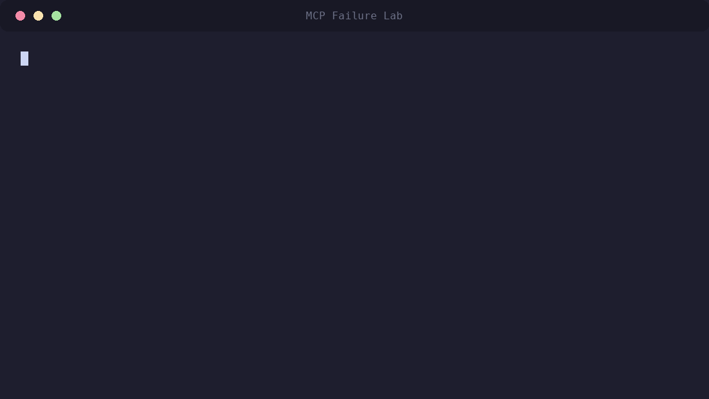
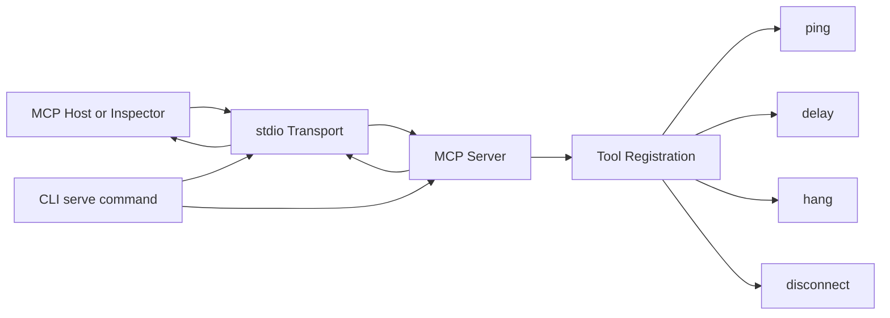
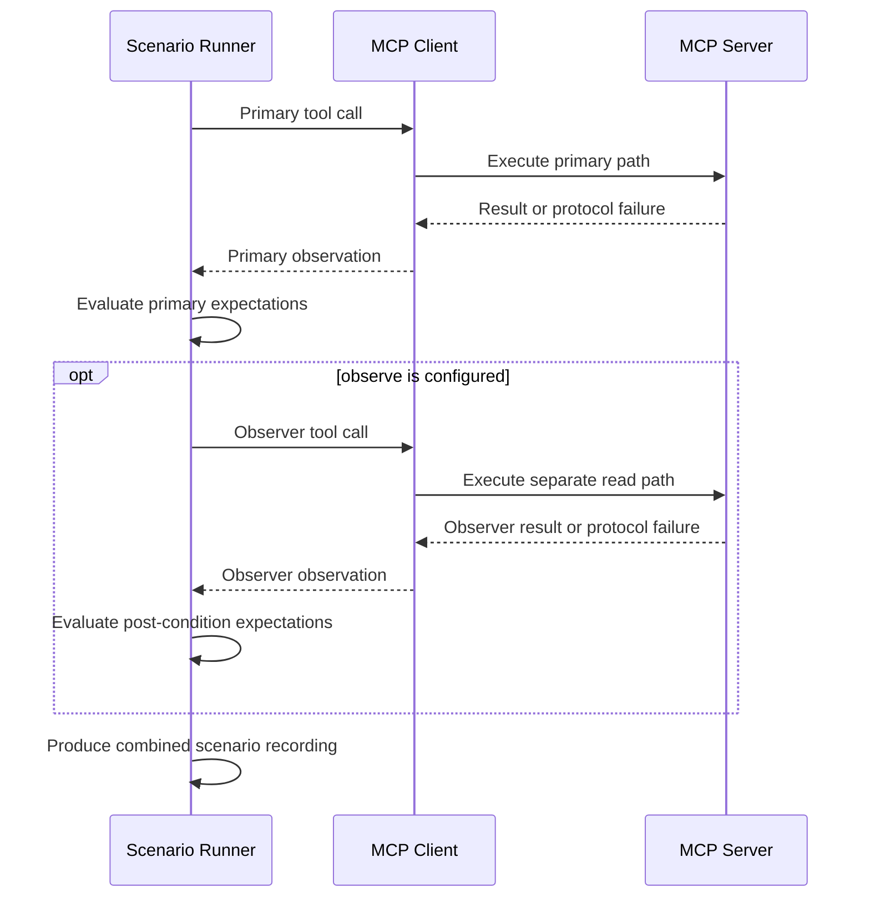
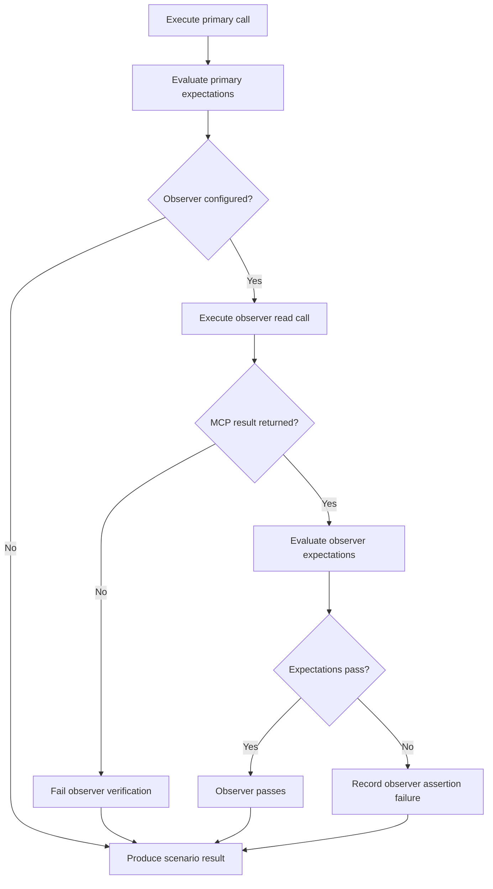
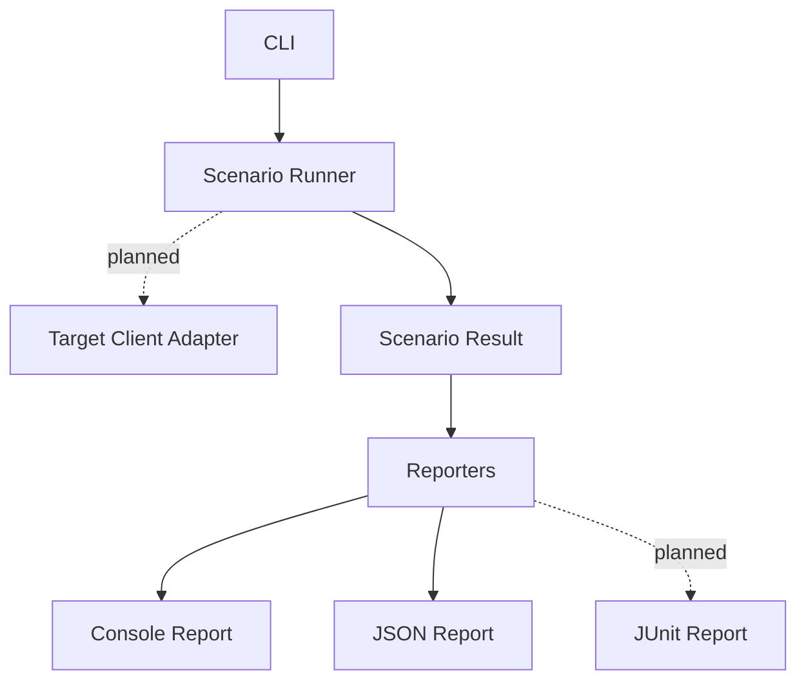
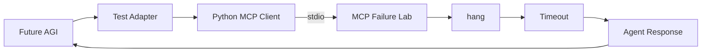

# MCP Failure Lab

[](https://www.npmjs.com/package/mcp-failure-lab)
[](https://github.com/anilloutombam/mcp-failure-lab/actions/workflows/ci.yml)

A chaos-engineering and resilience-testing toolkit for Model Context Protocol servers.



Try MCP Failure Lab without cloning the repository or installing it globally:

```bash
npx mcp-failure-lab demo
```

This runs a real deterministic 500ms delay scenario through MCP Failure Lab's built-in MCP client, server, scenario runner, and assertion pipeline.

Example output:

```text
MCP Failure Lab — Demo
Running a real 500ms delay scenario...

Scenario: Deterministic delay demo
Outcome: success
Duration: ~500 ms
Assertions: passed
```

The exact duration may vary slightly between runs. No API key or external MCP server is required.

See all available commands:

```bash
npx mcp-failure-lab --help
```

Start the MCP server over stdio:

```bash
npx mcp-failure-lab serve
```

Or clone the repository to run the included scenarios:

```bash
npm run dev -- run examples/scenarios/delay-success.json
```

## Goal

MCP Failure Lab helps server authors reproduce delays, hanging tools, cancellation, and transport loss in a deterministic way. Additional protocol faults are planned.

The project is being built incrementally, with an emphasis on protocol correctness, reproducible tests, explicit failure semantics, and clean operational behavior.

## Status

Usable early release. MCP Failure Lab can run deterministic JSON scenarios against
its built-in test server from the command line. It is not yet a general-purpose
proxy or an external MCP client test orchestrator.

Available now:

- A TypeScript command-line application
- A built-in `demo` command for running a real delay scenario directly from npm
- A `serve` command
- An MCP server factory
- MCP communication over stdio
- A discoverable `ping` tool
- A bounded, cancellation-aware `delay` fault tool
- A cancellation-aware `hang` fault tool
- A `disconnect` fault tool that interrupts the active transport
- Dependency-injected time for deterministic testing
- A code-first scenario model and in-process scenario runner
- CLI-driven JSON scenario files
- Outcome, maximum-duration, and MCP result assertions for scenario recordings
- Post-condition assertions through a sequential observer tool/read call
- Console and JSON scenario reporters
- Machine-readable JSON command errors
- CI-friendly exit codes for passes, assertion failures, and execution errors
- Unit, integration, and end-to-end test coverage
- Graceful `SIGINT` and `SIGTERM` handling
- Clean, reproducible build output
- Verification with MCP Inspector and independent MCP clients

Planned, but not implemented:

- JUnit reports
- Target-client adapters and external client orchestration
- Streamable HTTP transport
- Malformed-message, duplicate-response, and session-loss faults

## Architecture

### Current architecture



The stdio server path has five responsibilities:

- **CLI** — parses commands and starts the server through `serve`.
- **Transport** — `StdioServerTransport` exchanges JSON-RPC messages over standard input and output.
- **Server factory** — `createServer` constructs and configures the MCP server without starting I/O.
- **Health tool** — `ping` returns a deterministic, testable health response.
- **Fault tools** — `delay`, `hang`, and `disconnect` reproduce timing, cancellation, and transport-loss behavior.

Server construction and server execution remain separate. This allows future transports and integration tests to reuse the same server configuration.

### Request flow

```text
MCP Host
  → stdio transport
  → MCP server
  → registered tool handler
  → response, pending request, or transport interruption
```

Diagnostics must never be written to stdout while the stdio transport is active because stdout carries MCP protocol messages. Operational diagnostics are written to stderr.

## Scenario execution



The scenario system supports code-first TypeScript definitions and JSON files
loaded by the CLI. The runner executes the validated scenario through a real MCP
client connection, records the observed outcome and duration, then evaluates
declarative expectations. This validates failure semantics in-process without
introducing a proxy or a second fault implementation.
The primary and observer calls are sequential and share one MCP client connection.
They target separate tool paths, so the observer does not reuse the primary result
as evidence. The recording keeps both observations separate and combines their
assertion failures into the overall scenario status.

Observer verification follows this failure model:



A timeout, connection failure, or thrown error means the observer could not verify
state and therefore always fails the scenario. A returned MCP tool result—including
one with `isError: true`—is an observation and is evaluated against the configured
observer expectations.

The built-in `demo` command uses this same execution path. It runs a real
deterministic delay scenario through the MCP client and built-in server rather
than printing prerecorded output:

```text
npx mcp-failure-lab demo
        ↓
built-in scenario
        ↓
scenario runner
        ↓
MCP client
        ↓
in-memory MCP transport
        ↓
MCP Failure Lab server
        ↓
delay tool
        ↓
assertions
        ↓
console report
```

The runner does not yet orchestrate external MCP clients. Target-client adapters
are a separate future layer for verifying how a specific host reacts to the
controlled faulty server.

### Reporting and planned orchestration



Console and JSON reporting are implemented. Scenario expectations can assert the
observed outcome, maximum duration, MCP result error flag, and returned text
content. An optional observer call runs after the primary call and evaluates the
same expectations through a separate read path on the same MCP client connection.
Separate observer connections belong to the planned external orchestration layer.
Target-client adapters and JUnit reporting are planned.

The architecture will evolve incrementally. New abstractions will be introduced only when supported by a concrete requirement and corresponding tests.

## Requirements

- Node.js 22.19.0 or newer
- npm

## Installation

Try MCP Failure Lab directly from npm:

```bash
npx mcp-failure-lab demo
```

No global installation is required.

Display the available commands:

```bash
npx mcp-failure-lab --help
```

Or install it globally:

```bash
npm install -g mcp-failure-lab
```

## Usage

### Run the built-in demo

```bash
npx mcp-failure-lab demo
```

The demo executes a real deterministic 500ms delay scenario against the built-in MCP Failure Lab server and reports the observed outcome, duration, and assertion result.

### Display CLI help

```bash
npx mcp-failure-lab --help
```

### Display the current version

```bash
npx mcp-failure-lab --version
```

### Start the MCP server over stdio

```bash
npx mcp-failure-lab serve
```

The process waits silently for an MCP client. Press `Ctrl+C` to shut it down gracefully.

### Run a scenario

Scenario files use JSON. For example, `examples/scenarios/delay-success.json`
contains:

```json
{
  "name": "bounded delay succeeds",
  "call": {
    "tool": "delay",
    "args": {
      "delayMs": 250
    }
  },
  "timeoutMs": 1000,
  "expect": {
    "outcome": "success",
    "maxDurationMs": 500
  }
}
```

From a repository checkout, run the included scenario against an in-memory MCP
Failure Lab server:

```bash
npm run dev -- run examples/scenarios/delay-success.json
```

An expected timeout can pass too. The included `hang-timeout.json` scenario
verifies that a hanging tool reaches its configured deadline:

```bash
npm run dev -- run examples/scenarios/hang-timeout.json
```

Result assertions are nested under `expect.result`. `isError` checks the MCP tool
result error flag, while `textContains` searches only MCP content items whose type
is `text`. The substring match is case-sensitive:

```json
{
  "name": "delay returns expected result",
  "call": {
    "tool": "delay",
    "args": {
      "delayMs": 250
    }
  },
  "timeoutMs": 1000,
  "expect": {
    "outcome": "success",
    "maxDurationMs": 500,
    "result": {
      "isError": false,
      "textContains": "\"status\":\"delayed\""
    }
  }
}
```

Run the included result-assertion example with:

```bash
npm run dev -- run examples/scenarios/delay-result.json
```

Both result fields are optional. If `expect.result` is present but the tool call
times out or throws before returning a result, the result assertion fails.

### Observe state after a call

Add `observe` when a scenario needs to verify state through a separate tool or
read call after the primary call. Both calls use the same MCP client connection:

```json
{
  "name": "server remains responsive after a delay",
  "call": {
    "tool": "delay",
    "args": {
      "delayMs": 250
    }
  },
  "timeoutMs": 1000,
  "expect": {
    "outcome": "success"
  },
  "observe": {
    "call": {
      "tool": "ping",
      "args": {}
    },
    "timeoutMs": 1000,
    "expect": {
      "outcome": "success",
      "result": {
        "isError": false,
        "textContains": "\"status\":\"ok\""
      }
    }
  }
}
```

The observer always runs after the primary call, including when the primary call
returns an error, throws, or times out. Observer outcomes, durations, results,
errors, and assertion failures are recorded separately. Observer failures also
fail the overall scenario and are prefixed with `observer:` in the aggregate
failure list. A timeout, connection failure, or thrown observer error always fails
verification, even when the configured observer outcome is `error` or `timeout`.
An MCP tool result with `isError: true` is still an observable result and can be
asserted normally.

Run the included observer example with:

```bash
npm run dev -- run examples/scenarios/delay-observe-ping.json
```

Use `--report json` for machine-readable output:

```bash
npm run dev -- run examples/scenarios/delay-success.json --report json
```

Report formatting is implemented behind a small `ScenarioReporter` interface.
The console reporter renders the scenario name, observed outcome, duration,
assertion status, and any assertion failures. The JSON reporter emits this stable
structure:

```json
{
  "name": "bounded delay succeeds",
  "outcome": "success",
  "durationMs": 251.25,
  "passed": true,
  "failures": []
}
```

`outcome` is one of `success`, `error`, or `timeout`. `result` is included when
the MCP tool returns a result, and `error` is included as a string when execution
throws. When an observer is configured, the report also includes its outcome,
duration, assertion status, failures, and any returned result or execution error:

```json
{
  "name": "server remains responsive after a delay",
  "outcome": "success",
  "durationMs": 251.25,
  "passed": true,
  "failures": [],
  "observer": {
    "outcome": "success",
    "durationMs": 1.5,
    "passed": true,
    "failures": [],
    "result": {
      "content": [
        {
          "type": "text",
          "text": "{\"status\":\"ok\",\"timestamp\":\"2026-07-31T16:32:47.570Z\"}"
        }
      ]
    }
  }
}
```

Reports are returned to the command layer, which writes them to the
caller-selected output stream; reporters do not write to stdout themselves.

When JSON reporting is selected, input and execution failures also produce a
machine-readable report on stdout:

```json
{
  "passed": false,
  "error": {
    "code": "scenario_load_failed",
    "message": "Failed to run scenario: cannot read scenario file missing.json"
  }
}
```

Error codes are `invalid_arguments`, `scenario_load_failed`, and
`scenario_execution_failed`.

The command applies a 30-second timeout when the primary or observer `timeoutMs`
is omitted. Each call has its own timeout. The command exits with status `0` when
all expectations pass, `2` when scenario assertions fail, and `1` when the
scenario cannot be loaded or executed. It runs scenarios against MCP Failure Lab
itself; external MCP client orchestration is planned separately.

## Inspect the MCP server

Launch the official MCP Inspector against the published package:

```bash
npx @modelcontextprotocol/inspector npx mcp-failure-lab serve
```

In the Inspector:

1. Connect using the stdio transport.
2. Open **Tools**.
3. List the available tools.
4. Select `ping`.
5. Run the tool.

A successful response resembles:

```json
{
  "status": "ok",
  "timestamp": "2026-07-31T16:32:47.570Z"
}
```

The `delay` tool accepts `delayMs` from `0` through `30000` and waits that long
before returning a successful response. This can be used to verify client timeout
and cancellation behavior without introducing nondeterministic latency.

The `hang` tool intentionally never returns a response. It remains pending until
the client cancels the request, allowing timeout and cancellation cleanup paths to
be tested without leaving work running on the server.

The `disconnect` tool closes the active MCP transport while its request is in
flight. The client receives a connection failure instead of a tool response, which
exercises transport-loss recovery behavior.

Do not share or commit temporary authentication tokens included in Inspector URLs.

## Install for development

Clone the repository and install its dependencies:

```bash
git clone https://github.com/anilloutombam/mcp-failure-lab.git
cd mcp-failure-lab
npm install
```

## Development commands

Display development CLI help:

```bash
npm run dev -- --help
```

Run the built-in demo:

```bash
npm run dev -- demo
```

Display the development version:

```bash
npm run dev -- --version
```

Start the development MCP server over stdio:

```bash
npm --silent run dev -- serve
```

Format the repository:

```bash
npm run format
```

Check formatting without modifying files:

```bash
npm run format:check
```

Run TypeScript validation:

```bash
npm run typecheck
```

Run tests:

```bash
npm test
```

Create a clean production build:

```bash
npm run build
```

Run the compiled CLI:

```bash
npm run start -- --help
```

## Project structure

```text
mcp-failure-lab/
├── docs/
│   ├── demo.gif
│   └── demo.tape
├── examples/
│   ├── integrations/
│   │   └── futureagi/
│   │       ├── README.md
│   │       └── hang_test.py
│   └── scenarios/
│       ├── delay-observe-ping.json
│       ├── delay-result.json
│       ├── delay-success.json
│       └── hang-timeout.json
├── README.md
├── CONTRIBUTING.md
├── package.json
├── package-lock.json
├── tsconfig.json
├── vitest.config.ts
├── src/
│   ├── cli.ts
│   ├── cliCommand.ts
│   ├── delay.ts
│   ├── demoCommand.ts
│   ├── disconnect.ts
│   ├── hang.ts
│   ├── ping.ts
│   ├── reporter.ts
│   ├── runArguments.ts
│   ├── scenario.ts
│   ├── scenarioCommand.ts
│   ├── server.ts
│   └── version.ts
└── tests/
    ├── helpers/
    ├── e2e/
    ├── integration/
    ├── unit/
    └── tsconfig.json
```

Generated directories such as `dist/`, `coverage/`, and `node_modules/` are not committed.

## Testing strategy

The project separates tests by responsibility:

- **Unit tests** validate isolated domain behavior.
- **Integration tests** validate MCP client-server communication and transports.
- **End-to-end tests** validate CLI commands and scenario execution through real child processes.

Tests inject clocks and delay implementations where appropriate so assertions remain deterministic across machines, timezones, and test runs.

## External integration validation

MCP Failure Lab can be combined with external simulation and evaluation
frameworks to test how agents behave after deterministic MCP failures.

The published `mcp-failure-lab@0.3.2` package has been exercised with Future AGI
using an independent Python MCP client. The test invoked the real `hang` tool
over stdio, applied a client-side timeout, and passed the resulting failure into
simulated agent conversations for behavioral evaluation.

All 10 simulation calls completed. The external evaluation also identified
cases where the deliberately simple test adapter became repetitive after the
timeout, demonstrating the distinction between deterministic fault reproduction
and agent recovery behavior.



See [`examples/integrations/futureagi`](examples/integrations/futureagi) for
the experiment and reproduction steps.

## Development workflow

Development happens through focused branches and pull requests:

```bash
git switch -c feat/example-change
```

Before opening a pull request, run:

```bash
npm run format:check
npm run typecheck
npm test
npm run build
```

The `main` branch should remain in a working, reviewable state.

## Roadmap

- [x] Initialize the TypeScript CLI
- [x] Add the MCP server factory
- [x] Add stdio transport
- [x] Add the deterministic `ping` tool
- [x] Validate the server with MCP Inspector
- [x] Add MCP client-server integration coverage
- [x] Define the code-first scenario model
- [x] Add the first response-delay fault
- [x] Add timeout and maximum-duration assertions
- [x] Add CLI scenario execution
- [x] Add the built-in CLI demo
- [x] Add structured reports
- [x] Add CI
- [x] Add MCP result assertions
- [x] Add post-condition assertions through an observer/read path
- [ ] Add JUnit reports
- [ ] Add target-client adapters
- [ ] Add Streamable HTTP support
- [ ] Add malformed-message, duplicate-response, and session-loss faults
- [x] Publish the first npm release

## License

MIT
