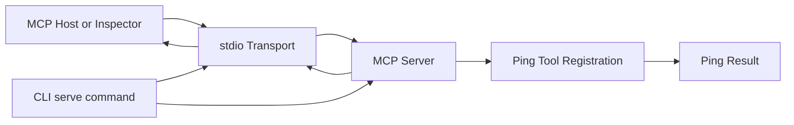
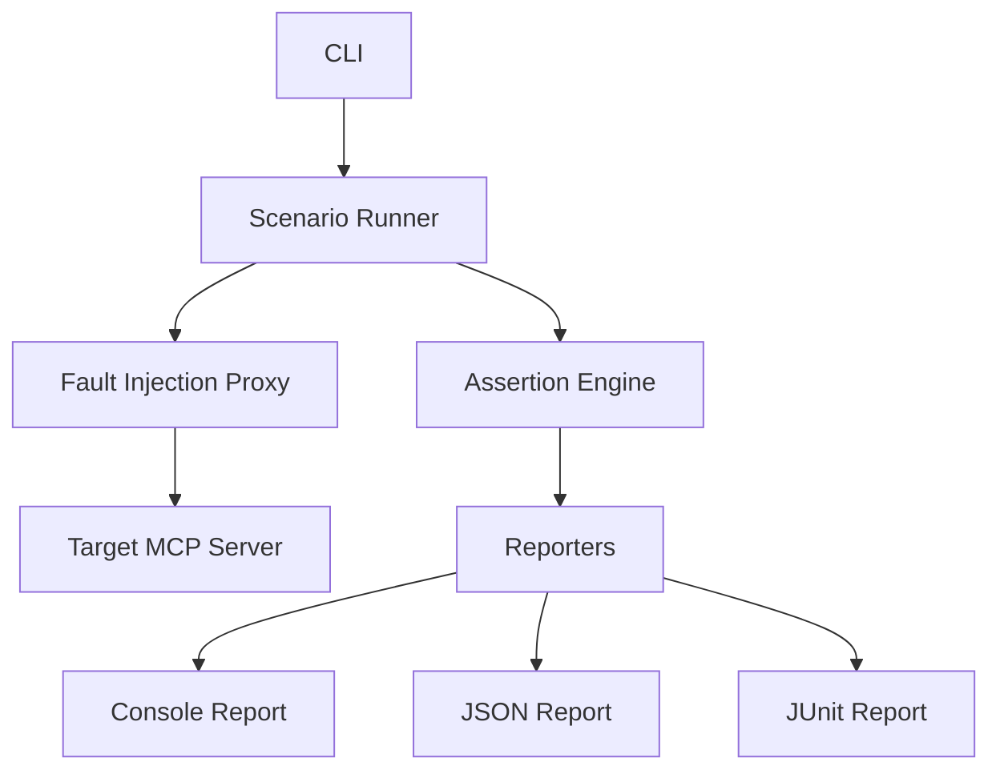

# MCP Failure Lab

A chaos-engineering and resilience-testing toolkit for Model Context Protocol servers.

## Goal

MCP Failure Lab helps server authors reproduce transport failures, hanging tools, malformed responses, session loss, cancellation races, and other reliability problems in a deterministic way.

The project is being built incrementally, with an emphasis on protocol correctness, reproducible tests, explicit failure semantics, and clean operational behavior.

## Status

Early development.

The first working milestone includes:

- A TypeScript command-line application
- A `serve` command
- An MCP server factory
- MCP communication over stdio
- A discoverable `ping` tool
- A bounded, cancellation-aware `delay` fault tool
- A cancellation-aware `hang` fault tool
- A `disconnect` fault tool that interrupts the active transport
- Dependency-injected time for deterministic testing
- Unit coverage for the ping result
- Graceful `SIGINT` and `SIGTERM` handling
- Clean, reproducible build output
- Manual end-to-end verification with MCP Inspector

General scenario execution and additional fault types are not implemented yet.

## Architecture

### Current architecture



The current implementation has four responsibilities:

- **CLI** — parses commands and starts the server through `serve`.
- **Transport** — `StdioServerTransport` exchanges JSON-RPC messages over standard input and output.
- **Server factory** — `createServer` constructs and configures the MCP server without starting I/O.
- **Ping tool** — registers the first MCP capability and returns a deterministic, testable health response.

Server construction and server execution remain separate. This allows future transports and integration tests to reuse the same server configuration.

### Request flow

```text
MCP Host
  → stdio transport
  → MCP server
  → ping tool handler
  → ping result
  → MCP response
```

Diagnostics must never be written to stdout while the stdio transport is active because stdout carries MCP protocol messages. Operational diagnostics are written to stderr.

## Planned architecture



Planned capabilities include:

- Deterministic fault scenarios
- Response delays and hanging tools
- Transport interruption
- Malformed MCP messages
- Duplicate responses
- Session loss
- Cancellation testing
- Timeout assertions
- Reproduction metadata
- Console, JSON, and JUnit reports

The architecture will evolve incrementally. New abstractions will be introduced only when supported by a concrete requirement and corresponding tests.

## Requirements

- Node.js 22.19.0 or newer
- npm

## Install for development

Clone the repository and install its dependencies:

```bash
git clone https://github.com/anilloutombam/mcp-failure-lab.git
cd mcp-failure-lab
npm install
```

The package has not been published to npm yet.

## Usage

Display CLI help:

```bash
npm run dev -- --help
```

Display the current version:

```bash
npm run dev -- --version
```

Start the MCP server over stdio:

```bash
npm --silent run dev -- serve
```

The process waits silently for an MCP client. Press `Ctrl+C` to shut it down gracefully.

## Inspect the MCP server

Launch the official MCP Inspector:

```bash
npx @modelcontextprotocol/inspector npm --silent run dev -- serve
```

In the Inspector:

1. Connect using the stdio transport.
2. Open **Tools**.
3. List the available tools.
4. Select `ping`.
5. Run the tool.

A successful response resembles:

```json
{
  "status": "ok",
  "timestamp": "2026-07-31T16:32:47.570Z"
}
```

The `delay` tool accepts `delayMs` from `0` through `30000` and waits that long
before returning a successful response. This can be used to verify client timeout
and cancellation behavior without introducing nondeterministic latency.

The `hang` tool intentionally never returns a response. It remains pending until
the client cancels the request, allowing timeout and cancellation cleanup paths to
be tested without leaving work running on the server.

The `disconnect` tool closes the active MCP transport while its request is in
flight. The client receives a connection failure instead of a tool response, which
exercises transport-loss recovery behavior.

Do not share or commit the temporary authentication token included in the Inspector URL.

## Development commands

Format the repository:

```bash
npm run format
```

Check formatting without modifying files:

```bash
npm run format:check
```

Run TypeScript validation:

```bash
npm run typecheck
```

Run tests:

```bash
npm test
```

Create a clean production build:

```bash
npm run build
```

Run the compiled CLI:

```bash
npm run start -- --help
```

## Project structure

```text
mcp-failure-lab/
├── README.md
├── package.json
├── package-lock.json
├── tsconfig.json
├── src/
│   ├── cli.ts
│   ├── ping.ts
│   └── server.ts
└── tests/
    ├── unit/
    │   └── ping.test.ts
    ├── integration/
    └── e2e/
```

Generated directories such as `dist/`, `coverage/`, and `node_modules/` are not committed.

## Testing strategy

The project separates tests by responsibility:

- **Unit tests** validate isolated domain behavior.
- **Integration tests** will validate MCP client-server communication and transports.
- **End-to-end tests** will validate CLI-driven scenarios involving real processes.

The current ping test injects a fixed clock so its result is deterministic across machines, timezones, and test runs.

## Engineering principles

- Prefer small, explicit interfaces.
- Keep transport logic separate from tool behavior.
- Treat all protocol and scenario data as untrusted.
- Handle cancellation, timeouts, process signals, and cleanup explicitly.
- Avoid writing diagnostics to stdout during stdio operation.
- Introduce abstractions only after a concrete requirement appears.
- Add regression coverage for every bug fix.
- Keep commits focused and reviewable.

## Development workflow

Development happens through focused branches and pull requests:

```bash
git switch -c feat/example-change
```

Before opening a pull request, run:

```bash
npm run format:check
npm run typecheck
npm test
npm run build
```

The `main` branch should remain in a working, reviewable state.

## Roadmap

- [x] Initialize the TypeScript CLI
- [x] Add the MCP server factory
- [x] Add stdio transport
- [x] Add the deterministic `ping` tool
- [x] Validate the server with MCP Inspector
- [x] Add MCP client-server integration coverage
- [ ] Define the scenario schema
- [ ] Add the first response-delay fault
- [ ] Add timeout assertions
- [ ] Add structured reports
- [ ] Add CI
- [ ] Add Streamable HTTP support
- [ ] Publish the first npm prerelease

## License

MIT
