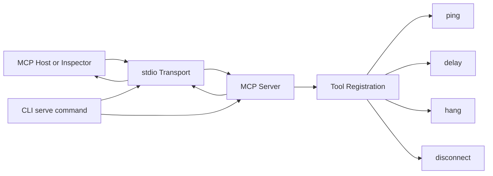
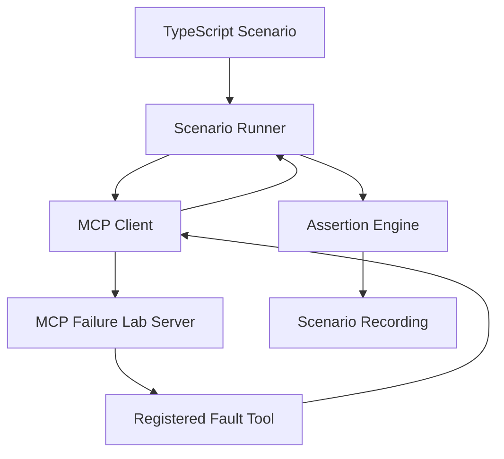
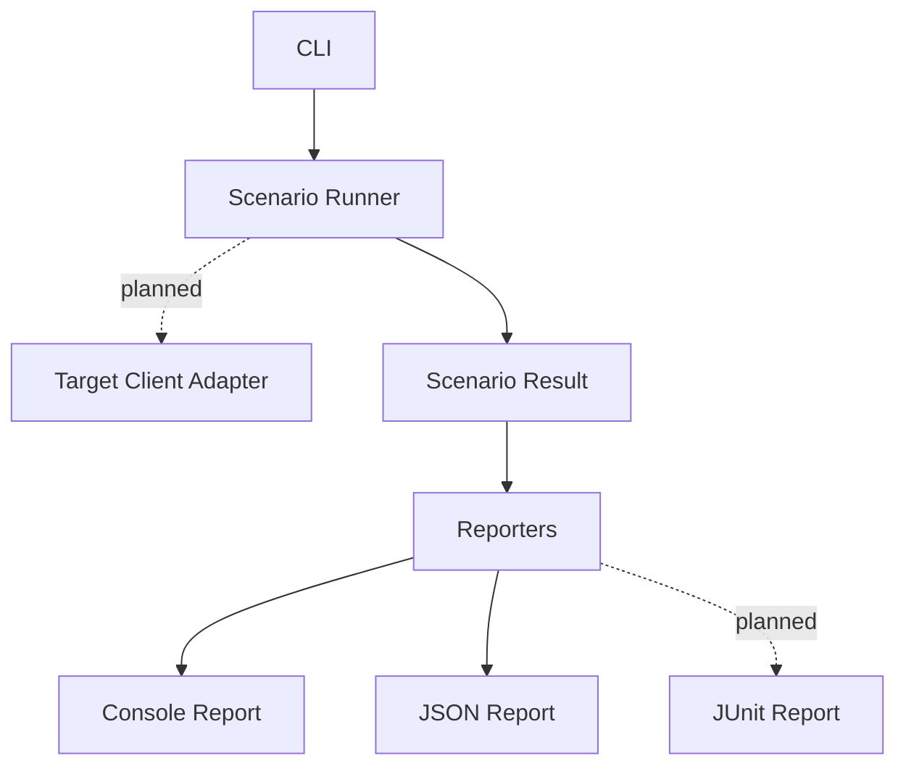
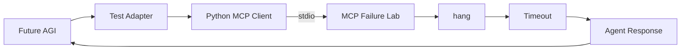

# MCP Failure Lab

[](https://www.npmjs.com/package/mcp-failure-lab)
[](https://github.com/anilloutombam/mcp-failure-lab/actions/workflows/ci.yml)

A chaos-engineering and resilience-testing toolkit for Model Context Protocol servers.


Try MCP Failure Lab without cloning or installing anything:

```bash
npx mcp-failure-lab --help
```

Start the MCP server over stdio:

```bash
npx mcp-failure-lab serve
```

Or clone the repository to run the included scenarios:

```bash
npm run dev -- run examples/scenarios/delay-success.json
```

## Goal

MCP Failure Lab helps server authors reproduce delays, hanging tools, cancellation, and transport loss in a deterministic way. Additional protocol faults are planned.

The project is being built incrementally, with an emphasis on protocol correctness, reproducible tests, explicit failure semantics, and clean operational behavior.

## Status

Usable early release. MCP Failure Lab can run deterministic JSON scenarios against
its built-in test server from the command line. It is not yet a general-purpose
proxy or an external MCP client test orchestrator.

Available now:

- A TypeScript command-line application
- A `serve` command
- An MCP server factory
- MCP communication over stdio
- A discoverable `ping` tool
- A bounded, cancellation-aware `delay` fault tool
- A cancellation-aware `hang` fault tool
- A `disconnect` fault tool that interrupts the active transport
- Dependency-injected time for deterministic testing
- A code-first scenario model and in-process scenario runner
- CLI-driven JSON scenario files
- Outcome and maximum-duration assertions for scenario recordings
- Console and JSON scenario reporters
- Machine-readable JSON command errors
- CI-friendly exit codes for passes, assertion failures, and execution errors
- Unit, integration, and end-to-end test coverage
- Graceful `SIGINT` and `SIGTERM` handling
- Clean, reproducible build output
- Verification with MCP Inspector and independent MCP clients

Planned, but not implemented:

- Post-condition assertions
- Independent observer/read-path verification
- JUnit reports
- Target-client adapters and external client orchestration
- Streamable HTTP transport
- Malformed-message, duplicate-response, and session-loss faults

## Architecture

### Current architecture



The current implementation has five responsibilities:

- **CLI** — parses commands and starts the server through `serve`.
- **Transport** — `StdioServerTransport` exchanges JSON-RPC messages over standard input and output.
- **Server factory** — `createServer` constructs and configures the MCP server without starting I/O.
- **Health tool** — `ping` returns a deterministic, testable health response.
- **Fault tools** — `delay`, `hang`, and `disconnect` reproduce timing, cancellation, and transport-loss behavior.

Server construction and server execution remain separate. This allows future transports and integration tests to reuse the same server configuration.

### Request flow

```text
MCP Host
  → stdio transport
  → MCP server
  → registered tool handler
  → response, pending request, or transport interruption
```

Diagnostics must never be written to stdout while the stdio transport is active because stdout carries MCP protocol messages. Operational diagnostics are written to stderr.

## Scenario execution



The initial runner executes code-first TypeScript scenarios against MCP Failure
Lab through a real MCP client connection. It records the observed outcome and
duration, then evaluates declarative expectations. This validates failure
semantics in-process without introducing a proxy or a second fault implementation.

The runner does not yet orchestrate external MCP clients. Target-client adapters
are a separate future layer for verifying how a specific host reacts to the
controlled faulty server.

### Reporting and planned orchestration



Console and JSON reporting are implemented. Target-client adapters and JUnit
reporting are planned. Post-condition assertions and independent observer/read-path
verification are also planned; current assertions cover only observed outcome and
maximum duration.

The architecture will evolve incrementally. New abstractions will be introduced only when supported by a concrete requirement and corresponding tests.

## Requirements

- Node.js 22.19.0 or newer
- npm

## Installation

Run MCP Failure Lab without installing it:

```bash
npx mcp-failure-lab --help
```

Or install it globally:

```bash
npm install -g mcp-failure-lab
```

## Usage

Display CLI help:

```bash
npx mcp-failure-lab --help
```

Display the current version:

```bash
npx mcp-failure-lab --version
```

Start the MCP server over stdio:

```bash
npx mcp-failure-lab serve
```

The process waits silently for an MCP client. Press `Ctrl+C` to shut it down gracefully.

### Run a scenario

Scenario files use JSON. For example, `examples/scenarios/delay-success.json`
contains:

```json
{
  "name": "bounded delay succeeds",
  "call": {
    "tool": "delay",
    "args": {
      "delayMs": 250
    }
  },
  "timeoutMs": 1000,
  "expect": {
    "outcome": "success",
    "maxDurationMs": 500
  }
}
```

From a repository checkout, run the included scenario against an in-memory MCP Failure Lab server:

```bash
npx mcp-failure-lab run examples/scenarios/delay-success.json
```

An expected timeout can pass too. The included `hang-timeout.json` scenario
verifies that a hanging tool reaches its configured deadline:

```bash
npx mcp-failure-lab run examples/scenarios/hang-timeout.json
```

Use `--report json` for machine-readable output:

```bash
npx mcp-failure-lab run examples/scenarios/delay-success.json --report json
```

Report formatting is implemented behind a small `ScenarioReporter` interface.
The console reporter renders the scenario name, observed outcome, duration,
assertion status, and any assertion failures. The JSON reporter emits this stable
structure:

```json
{
  "name": "bounded delay succeeds",
  "outcome": "success",
  "durationMs": 251.25,
  "passed": true,
  "failures": []
}
```

`outcome` is one of `success`, `error`, or `timeout`. `result` is included when
the MCP tool returns a result, and `error` is included as a string when execution
throws. Reports are returned to the command layer, which writes them to the
caller-selected output stream; reporters do not write to stdout themselves.

When JSON reporting is selected, input and execution failures also produce a
machine-readable report on stdout:

```json
{
  "passed": false,
  "error": {
    "code": "scenario_load_failed",
    "message": "Failed to run scenario: cannot read scenario file missing.json"
  }
}
```

Error codes are `invalid_arguments`, `scenario_load_failed`, and
`scenario_execution_failed`.

The command applies a 30-second timeout when `timeoutMs` is omitted. It exits with
status `0` when all expectations pass, `2` when scenario assertions fail, and `1`
when the scenario cannot be loaded or executed. This initial command runs
scenarios against MCP Failure Lab itself; external MCP client orchestration is
planned separately.

## Inspect the MCP server

Launch the official MCP Inspector against the published package:

```bash
npx @modelcontextprotocol/inspector npx mcp-failure-lab serve
```

In the Inspector:

1. Connect using the stdio transport.
2. Open **Tools**.
3. List the available tools.
4. Select `ping`.
5. Run the tool.

A successful response resembles:

```json
{
  "status": "ok",
  "timestamp": "2026-07-31T16:32:47.570Z"
}
```

The `delay` tool accepts `delayMs` from `0` through `30000` and waits that long
before returning a successful response. This can be used to verify client timeout
and cancellation behavior without introducing nondeterministic latency.

The `hang` tool intentionally never returns a response. It remains pending until
the client cancels the request, allowing timeout and cancellation cleanup paths to
be tested without leaving work running on the server.

The `disconnect` tool closes the active MCP transport while its request is in
flight. The client receives a connection failure instead of a tool response, which
exercises transport-loss recovery behavior.

Do not share or commit temporary authentication tokens included in Inspector URLs.

## Install for development

Clone the repository and install its dependencies:

```bash
git clone https://github.com/anilloutombam/mcp-failure-lab.git
cd mcp-failure-lab
npm install
```

## Development commands

Display development CLI help:

```bash
npm run dev -- --help
```

Display the development version:

```bash
npm run dev -- --version
```

Start the development MCP server over stdio:

```bash
npm --silent run dev -- serve
```

Format the repository:

```bash
npm run format
```

Check formatting without modifying files:

```bash
npm run format:check
```

Run TypeScript validation:

```bash
npm run typecheck
```

Run tests:

```bash
npm test
```

Create a clean production build:

```bash
npm run build
```

Run the compiled CLI:

```bash
npm run start -- --help
```

## Project structure

```text
mcp-failure-lab/
├── docs/
│   ├── demo.gif
│   └── demo.tape
├── examples/
│   └── scenarios/
│       ├── delay-success.json
│       └── hang-timeout.json
├── README.md
├── package.json
├── package-lock.json
├── tsconfig.json
├── vitest.config.ts
├── src/
│   ├── cli.ts
│   ├── delay.ts
│   ├── disconnect.ts
│   ├── hang.ts
│   ├── ping.ts
│   ├── reporter.ts
│   ├── runArguments.ts
│   ├── scenario.ts
│   ├── scenarioCommand.ts
│   ├── server.ts
│   └── version.ts
└── tests/
    ├── helpers/
    ├── e2e/
    ├── integration/
    ├── unit/
    └── tsconfig.json
```

Generated directories such as `dist/`, `coverage/`, and `node_modules/` are not committed.

## Testing strategy

The project separates tests by responsibility:

- **Unit tests** validate isolated domain behavior.
- **Integration tests** validate MCP client-server communication and transports.
- **End-to-end tests** validate CLI-driven scenarios involving real processes.

Tests inject clocks and delay implementations where appropriate so assertions remain deterministic across machines, timezones, and test runs.

## External integration validation

MCP Failure Lab can be combined with external simulation and evaluation
frameworks to test how agents behave after deterministic MCP failures.

The published `mcp-failure-lab@0.3.2` package has been exercised with Future AGI
using an independent Python MCP client. The test invoked the real `hang` tool
over stdio, applied a client-side timeout, and passed the resulting failure into
simulated agent conversations for behavioral evaluation.

All 10 simulation calls completed. The external evaluation also identified
cases where the deliberately simple test adapter became repetitive after the
timeout, demonstrating the distinction between deterministic fault reproduction
and agent recovery behavior.



See [`examples/integrations/futureagi`](examples/integrations/futureagi) for
the experiment and reproduction steps.

## Engineering principles

- Prefer small, explicit interfaces.
- Keep transport logic separate from tool behavior.
- Treat all protocol and scenario data as untrusted.
- Handle cancellation, timeouts, process signals, and cleanup explicitly.
- Avoid writing diagnostics to stdout during stdio operation.
- Introduce abstractions only after a concrete requirement appears.
- Add regression coverage for every bug fix.
- Keep commits focused and reviewable.

## Development workflow

Development happens through focused branches and pull requests:

```bash
git switch -c feat/example-change
```

Before opening a pull request, run:

```bash
npm run format:check
npm run typecheck
npm test
npm run build
```

The `main` branch should remain in a working, reviewable state.

## Roadmap

- [x] Initialize the TypeScript CLI
- [x] Add the MCP server factory
- [x] Add stdio transport
- [x] Add the deterministic `ping` tool
- [x] Validate the server with MCP Inspector
- [x] Add MCP client-server integration coverage
- [x] Define the code-first scenario model
- [x] Add the first response-delay fault
- [x] Add timeout and maximum-duration assertions
- [x] Add CLI scenario execution
- [x] Add structured reports
- [x] Add CI
- [ ] Add post-condition assertions
- [ ] Add independent observer/read-path verification
- [ ] Add JUnit reports
- [ ] Add target-client adapters
- [ ] Add Streamable HTTP support
- [ ] Add malformed-message, duplicate-response, and session-loss faults
- [x] Publish the first npm release

## License

MIT
