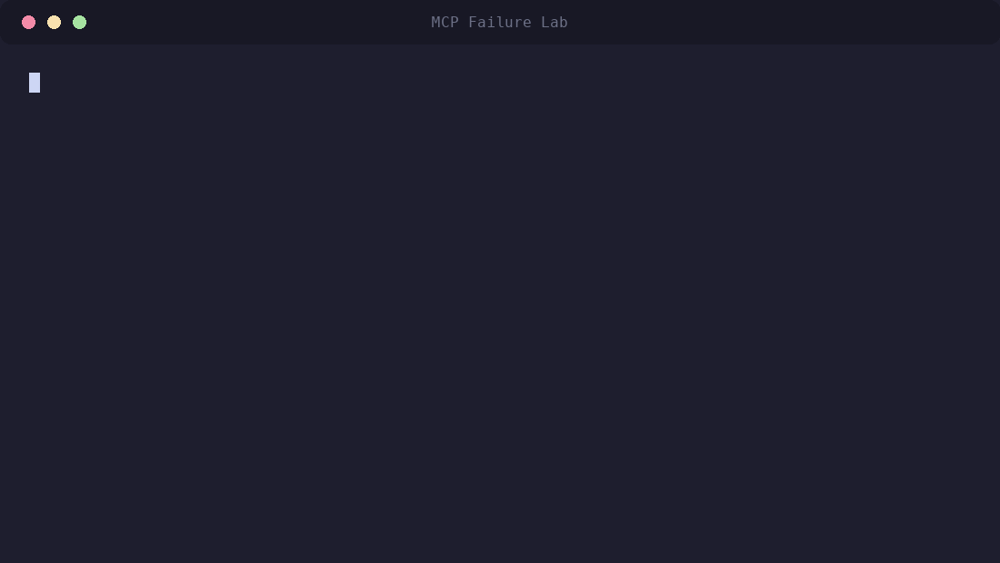

# MCP Failure Lab

Reproduce MCP timeouts, cancellation races, transport loss, and invalid responses with repeatable tests and CI reports.

<p align="center">
  <picture>
    <source media="(prefers-color-scheme: dark)" srcset="https://mcplab.dev/brand/mcp-failure-lab-logo-dark.svg">
    <source media="(prefers-color-scheme: light)" srcset="https://mcplab.dev/brand/mcp-failure-lab-logo-light.svg">
    
  </picture>
</p>

[](https://www.npmjs.com/package/mcp-failure-lab)
[](https://github.com/anilloutombam/mcp-failure-lab/actions/workflows/ci.yml)
[](https://registry.modelcontextprotocol.io/)
[](https://github.com/mcp/anilloutombam/mcp-failure-lab)

[](LICENSE)

[Documentation](https://mcplab.dev/docs/) ·
[Compatibility](https://mcplab.dev/docs/compatibility/) ·
[Project page](https://mcplab.dev/failure)

Example output (duration varies):

```text
$ npx mcp-failure-lab demo
MCP Failure Lab — Demo
Running a real 500ms delay scenario...

Scenario: Deterministic delay demo
Outcome: success
Duration: ~500 ms
Assertions: passed
```

## Why this exists

Real MCP clients behave differently when things break. A timeout may leave a connection usable;
an interrupted response may close it. A malformed reply may be rejected by one client and accepted by another.

Failure Lab makes those cases repeatable so you can check both the failed call and what happens next.

## Real-world findings

- [Python SDK #3522](https://github.com/modelcontextprotocol/python-sdk/issues/3522): Python `mcp` 2.2.0 stayed closed after an interrupted HTTP response, rejected the next request, and raised an `ExceptionGroup` during cleanup.
- [Rust SDK #1283](https://github.com/modelcontextprotocol/rust-sdk/issues/1283): `rmcp` 3.4.0 accepted an invalid response containing both `result` and `error` over stdio and HTTP.
- [Ruby SDK #589](https://github.com/modelcontextprotocol/ruby-sdk/issues/589): `mcp` 1.6.1 accepted responses missing `jsonrpc` or declaring `jsonrpc: "1.0"` over stdio and HTTP in all three repeats. The [Ruby report](docs/compatibility/ruby-sdk-1.6.1.md) records all 60 executions; the results and upstream finding are included in the Observatory export.
- Java SDK 2.0.1 accepted `jsonrpc: "1.0"` over both transports ([#1156](https://github.com/modelcontextprotocol/java-sdk/issues/1156)). Over stdio, responses missing `jsonrpc` or containing both `result` and `error` left the next `ping` timing out ([#1157](https://github.com/modelcontextprotocol/java-sdk/issues/1157)). See the [Java report](docs/compatibility/java-sdk-2.0.1.md).
- [Duplicate-response comparison](docs/compatibility/v0.10.0.md): all five tested SDKs completed the next `ping`. TypeScript reported the duplicate through its error callback; the other harnesses surfaced no call-level duplicate error.

The SDK comparisons describe specific tested versions, not every release.
See the [versioned reports](docs/compatibility/README.md) for reproduction steps and limitations.



## Quick start

Requires Node.js 22.19.0 or newer and npm.

```bash
npx mcp-failure-lab demo
```

The demo needs no API key, external server, or global installation. To test your own MCP client,
connect it to Failure Lab over stdio or local Streamable HTTP:

```bash
npx mcp-failure-lab serve
# Or:
npx mcp-failure-lab serve --transport http
```

The stdio process waits for a client; it is not an interactive terminal command. Configure your
client to launch it, or follow the [getting started guide](https://mcplab.dev/docs/getting-started/).
Press `Ctrl+C` to stop a manually started server.

HTTP defaults to `http://127.0.0.1:3000/mcp`. It provides neither authentication nor TLS;
do not expose it to an untrusted network.

## Test your own MCP server

External targets support HTTP and stdio. After the
[repository setup](https://mcplab.dev/docs/getting-started/#run-an-included-scenario),
install the official GitHub MCP server with its executable on `PATH` and set
`GITHUB_PERSONAL_ACCESS_TOKEN` in your environment. Then run:

```bash
npm run dev -- run examples/scenarios/github-get-me.json \
  --target examples/targets/github-stdio.json
```

The example calls GitHub's read-only `get_me` tool. Its target configuration uses `envFrom`
to pass the token from your environment rather than storing it in JSON.
For your own [scenario](https://mcplab.dev/docs/scenarios/) and
[target configuration](https://mcplab.dev/docs/external-targets/), use:

```bash
npx mcp-failure-lab run scenario.json --target target.json
```

External runs check tool results, deadlines, and adapter setup and cleanup.
They do **not** inject faults into another server; Failure Lab is not a proxy.

See the [external targets guide](https://mcplab.dev/docs/external-targets/) for prerequisites, credential handling, and configuration.

## What Failure Lab can break

The built-in server exposes these tools for testing client behavior:

| Tool                          | Behavior                                                     |
| ----------------------------- | ------------------------------------------------------------ |
| `ping`                        | Returns a deterministic health response                      |
| `protocol_ping_liveness`      | Sends a bounded protocol ping during its in-flight call      |
| `delay`                       | Waits for a bounded duration before returning                |
| `hang`                        | Remains pending until the client cancels                     |
| `disconnect`                  | Interrupts the active transport while a request is in flight |
| `malformed_message`           | Violates one selected JSON-RPC response rule exactly once    |
| `duplicate_response`          | Sends the same JSON-RPC response twice for one request       |
| `response_after_cancellation` | Sends one late response for a cancelled stdio request        |
| `session_loss`                | Invalidates the caller's legacy HTTP session                 |

Protocol `ping` is distinct from the `ping` tool. Built-in scenarios default to MCP `2026-07-28`;
protocol liveness requires scenario `protocolVersion: "2025-11-25"`.
Both public transports accept legacy clients.

See the [fault tools reference](https://mcplab.dev/docs/fault-tools/) for timing bounds, activation, cancellation, cleanup, and transport limits.

## How recovery testing works

Trigger a fault, record its outcome, then make a second request on the same connection.
A detected fault does not prove recovery; the follow-up must succeed too.

Scenario `observe` calls run after the primary call, including errors and timeouts.
For example, [duplicate-response.json](examples/scenarios/duplicate-response.json)
calls `duplicate_response`, then uses `ping` to check that the connection remains usable:

```bash
# From a repository checkout
npm run dev -- run examples/scenarios/duplicate-response.json
```

This checks post-fault behavior, not an automatic recovery policy.
A stdio disconnect terminates the server process and requires a new process and connection.

See [Scenarios](https://mcplab.dev/docs/scenarios/) for outcome, duration, result, and observer assertions.

## SDK / transport evidence

[MCP Failure Observatory](https://observatory.mcplab.dev) collects SDK and transport evidence.
The [repository reports](docs/compatibility/README.md) preserve tested versions, methods, and limitations.

Results vary by SDK, version, transport, and protocol. A passing run is evidence for that combination,
not a guarantee for every client.

## CI usage

Save a [scenario file](https://mcplab.dev/docs/scenarios/) with explicit expectations and timeouts,
then produce a JUnit report:

```bash
npx mcp-failure-lab run scenario.json --report junit > junit.xml
```

Pin the Failure Lab package version in CI so upgrades do not change the test environment unexpectedly.

Exit codes: `0` means expectations passed, `1` means the scenario could not be loaded or executed,
and `2` means an assertion failed. An expected timeout can pass; an unexpected success can fail.

See [Reporting](https://mcplab.dev/docs/reporting/) for JSON, JUnit, and lifecycle diagnostics.

## Documentation

Detailed guides live at [mcplab.dev](https://mcplab.dev/docs/):
[Getting started](https://mcplab.dev/docs/getting-started/) ·
[CLI](https://mcplab.dev/docs/cli/) ·
[Architecture](https://mcplab.dev/docs/architecture/) ·
[Troubleshooting](https://mcplab.dev/docs/troubleshooting/).

## Contributing

See [CONTRIBUTING.md](CONTRIBUTING.md) for setup, tests, and the contribution workflow.
Planned work is tracked in [GitHub Issues](https://github.com/anilloutombam/mcp-failure-lab/issues).

If Failure Lab helps you test an MCP integration, consider starring the repository.

## License

[MIT](LICENSE)
