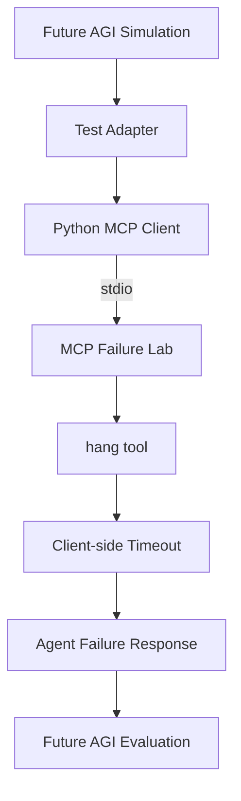

# Future AGI integration example

This example demonstrates how MCP Failure Lab can be combined with an external
agent simulation and evaluation framework to test agent behavior under a
deterministic MCP failure.

The experiment uses Future AGI for simulation and evaluation, an independent
Python MCP client for protocol communication, and the published
`mcp-failure-lab` package as the fault-producing MCP server.

This is an integration example, not an official Future AGI integration or
endorsement.

## What this validates

The test exercises the following path:



MCP Failure Lab is responsible for deterministically reproducing the hanging
tool call. The surrounding simulation framework is responsible for evaluating
how an agent behaves after that failure occurs.

This separation is intentional: reproducing a failure and evaluating recovery
behavior are different concerns.

## Validated configuration

The initial validation was performed with:

- `mcp-failure-lab@0.3.2`
- Future AGI simulation
- Python 3.12
- the Python MCP SDK
- stdio transport
- the MCP Failure Lab `hang` tool
- a 3-second client-side timeout

The published npm package was used rather than a local MCP Failure Lab checkout.

## Observed result

The external MCP client successfully:

1. started `mcp-failure-lab@0.3.2` through `npx`;
2. initialized an MCP session over stdio;
3. discovered `ping`, `delay`, `hang`, and `disconnect`;
4. invoked the real `hang` tool; and
5. observed the request remain pending until the configured client timeout.

The same interaction was then exercised from a Future AGI simulation.

Ten generated simulation calls completed. The evaluation also identified
follow-up cases where the deliberately simple test adapter became repetitive
after the timeout.

That distinction is useful: MCP Failure Lab reliably reproduced the fault,
while the external evaluator independently assessed the agent's recovery
behavior.

## Prerequisites

This example requires:

- Node.js compatible with the current MCP Failure Lab release
- npm / npx
- Python 3.12
- a Python virtual environment
- a Future AGI account and API credentials

Install the Python dependencies required by your Future AGI environment and the
MCP client:

```bash
pip install agent-simulate mcp
```

Configure Future AGI credentials according to the Future AGI SDK documentation.

## Future AGI setup

Create an agent definition that instructs the test agent not to fabricate
successful tool execution.

For example, the test agent should follow behavior equivalent to:

> When an operation requires a tool, use the available tool rather than
> inventing a result. If the tool does not respond, times out, or becomes
> unavailable, do not claim that the operation succeeded and do not retry
> indefinitely.

Create a simulation containing scenarios where an operation depends on a tool
that becomes unavailable or unresponsive.

The example script expects a Future AGI run test named:

```text
MCP Failure Lab Hang Test
```

Change `RUN_TEST_NAME` in the script if your test uses another name.

## Run the example

From an activated Python environment:

```bash
python examples/integrations/futureagi/hang_test.py
```

For each simulated conversation, the adapter invokes the MCP Failure Lab
`hang` tool once.

Expected diagnostic output includes:

```text
MCP connected: mcp-failure-lab@0.3.2
MCP tools: ['ping', 'delay', 'hang', 'disconnect']
Calling real MCP 'hang' tool (timeout=3s)...
MCP RESULT: hang timed out as expected
```

Future AGI may continue the simulated conversation after the timeout so that
post-failure behavior can be evaluated.

## Interpreting the result

A successful MCP fault reproduction means:

- the MCP server started;
- MCP initialization succeeded;
- the `hang` tool was discoverable;
- the tool call remained pending; and
- the independent client reached its configured timeout.

A simulation evaluator may still identify poor agent behavior after the fault,
such as repetitive responses, unnecessary retries, false success claims, or
failure to offer an appropriate recovery path.

Those findings do not mean the fault injection failed. They are the behavior
that an external evaluation framework can measure once MCP Failure Lab has
created the failure condition.

## Scope

This example currently demonstrates the `hang` fault only.

MCP Failure Lab also exposes other deterministic fault behaviors that can be
used for additional integrations, including bounded delays and transport
disconnects.
